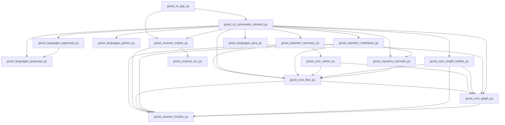

# gnost — Project Onboarding Guide

_Generated automatically by <a href='https://gnost.readthedocs.io'>GNOST</a>._

## Project Overview

- **Root:** `/Users/mohdzain/Documents/GitHub/gnost`
- **Languages:** python (41)
- **Framework:** Not detected

## Entry Points

- `gnost/cli/app.py` — __main__ guard
- `gnost/languages/python.py` — __main__ guard
- `gnost/languages/python.py` — uvicorn.run

## Execution Flow (High Level)

- `gnost/cli/app.py` → `gnost/cli/commands/onboard.py` → `gnost/languages/typescript.py` → `gnost/languages/javascript.py` → `gnost/languages/base.py`
- `gnost/cli/app.py` → `gnost/cli/commands/onboard.py` → `gnost/core/insight_builder.py` → `gnost/scanner/models.py` → `gnost/languages/base.py`
- `gnost/cli/app.py` → `gnost/cli/commands/onboard.py` → `gnost/core/insight_builder.py` → `gnost/core/flow.py` → `gnost/languages/base.py`
- `gnost/cli/app.py` → `gnost/cli/commands/onboard.py` → `gnost/core/insight_builder.py` → `gnost/core/flow.py` → `gnost/scanner/models.py` → `gnost/languages/base.py`
- `gnost/cli/app.py` → `gnost/cli/commands/onboard.py` → `gnost/core/insight_builder.py` → `gnost/core/flow.py` → `gnost/core/graph.py` → `gnost/scanner/models.py` → `gnost/languages/base.py`

_(48 additional paths omitted for clarity.)_

## Execution Flow (Overview)

> 📌 This diagram shows the high-level execution flow. For the complete flow, see [**flow/flow-full.md**](./flow/flow-full.md) Raw Mermaid: [flow/flow-full.mmd](./flow/flow-full.mmd)

## Recommended Reading Order

### Start Here

- `gnost/cli/app.py`
- `gnost/languages/python.py`

### Core Logic

- `gnost/cli/commands/onboard.py`
- `gnost/core/flow.py`
- `gnost/core/graph.py`
- `gnost/core/insight_builder.py`
- `gnost/core/ranker.py`
- `gnost/languages/java.py`
- `gnost/languages/javascript.py`
- `gnost/languages/python.py`
- `gnost/languages/typescript.py`
- `gnost/reporters/markdown.py`
- `gnost/reporters/mermaid.py`
- `gnost/reporters/summary.py`
- `gnost/scanner/engine.py`
- `gnost/scanner/loc.py`
- `gnost/scanner/models.py`

### Supporting / Leaf Code

- `gnost/config/languages.py`
- `gnost/languages/base.py`
- `gnost/models/insights.py`
- `gnost/reporters/readme.py`
- `gnost/scanner/classify.py`
- `gnost/scanner/filters.py`
- `gnost/utils/printer.py`
- `gnost/utils/progress.py`

## 📘 First Files to Read
- **`gnost/cli/app.py`**
  - Primary entry point into the application
- **`cli/commands/onboard.py`**
  - Core logic file referenced by multiple execution paths
- **`gnost/scanner/engine.py`**
  - Core logic file referenced by multiple execution paths
- **`gnost/languages/python.py`**
  - Primary entry point into the application
- **`gnost/reporters/summary.py`**
  - Core logic file referenced by multiple execution paths
- **`gnost/reporters/markdown.py`**
  - Core logic file referenced by multiple execution paths
- **`gnost/core/insight_builder.py`**
  - Core logic file referenced by multiple execution paths
- **`gnost/scanner/loc.py`**
  - Core logic file referenced by multiple execution paths
- **`gnost/core/flow.py`**
  - Core logic file referenced by multiple execution paths
- **`gnost/reporters/mermaid.py`**
  - Core logic file referenced by multiple execution paths

## ⚠️ Caution Areas
### `gnost/scanner/models.py`
- **Type:** high_impact
- **Severity:** 5
- Many files depend on this module
### `gnost/languages/base.py`
- **Type:** high_impact
- **Severity:** 5
- Many files depend on this module
### `gnost/core/graph.py`
- **Type:** high_impact
- **Severity:** 5
- Many files depend on this module
### `gnost/core/flow.py`
- **Type:** high_impact
- **Severity:** 5
- Many files depend on this module
### `cli/commands/onboard.py`
- **Type:** tight_coupling
- **Severity:** 4
- File has a high number of dependencies
## Key Execution Paths

To understand specific scenarios, see the entry-based execution paths:

- 📍 [Entry-based Paths](flow/entry-paths.md)

- 🧭 [folder-based Paths](flow/folder-paths.md)

(Complete system flow: [flow/flow-full.md](flow/flow-full.md))
