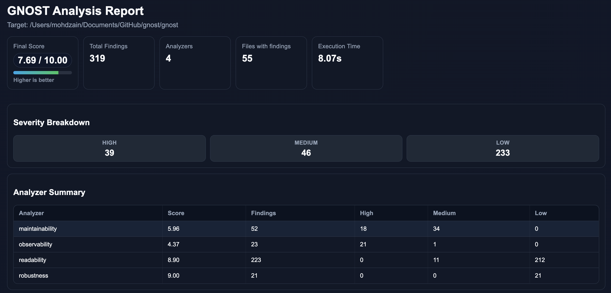

GNOST — Codebase Knowledge
=======================================

GNOST helps developers understand unfamiliar codebases by identifying
entry points, execution flow, and core logic automatically.

It also supports code quality analysis through ``gnost analyze`` to score and flag
maintainability, robustness, observability, and readability issues.

It is designed for **first-day onboarding** as well as code quality triage and
continuous reporting, not just code statistics.

Usage
-----

Complete CLI usage::

    usage: gnost [command]

    options:
    -h, --help  show this help message and exit
    --version   show program's version number and exit

    Available Commands:
    command
        summary   Show a summary table
        stats     Show detailed stats per language
        folders   Show LOC grouped by folder
        files     Show the largest files by LOC
        version   Display gnost version
        onboard   Onboard a new codebase
        analyze   Analyze the codebase
        open      Open generated reports

    Command Options:
    summary|stats|folders|files:
        --include  Comma-separated folder names to include
        --exclude  Comma-separated folder names to exclude
        --progress Show a progress bar while scanning

    onboard:
        --progress Show a progress bar while onboarding
        --mermaid  Generate only Mermaid flow diagram (FLOW.mmd)
        --inject   Inject onboarding link into README.md files
        --layered  Produce Layered mermaid as Entry -> Core -> Leaf
        --depth    Limit execution flow depth (e.g. --depth 2)

    analyze:
        path                    File or directory to analyze (default: .)
        -a, --analyzer          Enable only specific analyzers
        --parallel              Run analyzers in parallel
        -o, --out               Write JSON and HTML report to docs/analysis/gnost_analysis.json|html
        -v, --verbose           Show traceback on failures
        --quiet                 Reduce logs; keep warnings/errors only
        --list-analyzers        List available analyzers and exit
        --timeout SECONDS       Analyzer timeout (default: 900)
        --compact               Write compact JSON when --out is used
        --no-progress           Hide progress updates
        --max-findings N        Per-analyzer findings limit (default: 1000)

    open:
        report|rpt              Open the generated report in browser

    files:
        --top      Number of files to show (default: 5)
    Use `gnost <command> --help` for full command options.

Run GNOST commands from the root of a repository::

    gnost summary [path]
    gnost stats [path]
    gnost folders [path]
    gnost files [path] --top 10
    gnost onboard [path]
    gnost analyze [path] --parallel -o
    gnost open report

Subcommand usage::

    gnost summary [path] [--include INCLUDE] [--exclude EXCLUDE] [--progress]
    gnost stats [path] [--include INCLUDE] [--exclude EXCLUDE] [--progress]
    gnost folders [path] [--include INCLUDE] [--exclude EXCLUDE] [--progress]
    gnost files [path] [--include INCLUDE] [--exclude EXCLUDE] [--progress] [--top TOP]
    gnost onboard [path] [--mermaid] [--progress] [--inject] [--layered] [--depth DEPTH]
    gnost analyze [path] [--parallel] [--out] [--list-analyzers] [--no-progress]
    gnost open report|rpt
    gnost version

Key Commands
------------

``summary``
    Show a high-level project summary.

``stats``
    Show detailed language statistics.

``folders``
    Show lines of code grouped by folder.

``files``
    Show the largest files by lines of code.

``onboard``
    Generate onboarding summary and execution flow outputs.

``analyze``
    Analyze code quality and generate JSON/HTML findings report.

``open``
    Open the generated analysis report from terminal.

``version``
    Display GNOST version.

Onboarding & Flow Analysis
--------------------------

Generate onboarding documentation::

    gnost onboard .

Generate only a Mermaid flow diagram::

    gnost onboard . --mermaid

This produces:

- **ONBOARD.md** — onboarding guide for new contributors
- **flow folder** — pure Mermaid execution flow diagrams

  - *flow-full.md* — Full Flow diagram
  - *flow-overview.mmd* — Overview Mermaid with entry and core nodes
  - *entry-paths.md* — Mermaid of different entry paths
  - *folder-paths.md* — Mermaid of all paths inside different folders

Code Analysis
-------------

Run quality analysis::

    gnost analyze .

Run with all analyzers and write report files::

    gnost analyze . --parallel -o

Available findings output::

- Terminal rich table with analyzer score and severity counts
- ``docs/analysis/gnost_analysis.json`` for CI or scripting
- ``docs/analysis/gnost_analysis.html`` for interactive inspection

Example report:

Open report::

    gnost open report

Use CLI docs
-------------

Use dedicated pages for details:

.. toctree::
   :maxdepth: 2
   :caption: Contents

   onboard
   analyze
   analyzer_guide

Options
-------

``--include``
    Comma-separated folders to include.

``--exclude``
    Comma-separated folders to exclude.

``--top``
    Number of files to show with ``files``.

``--progress``
    Show a progress bar while scanning or onboarding.

``--mermaid``
    Generate only Mermaid flow diagram (FLOW.mmd) (onboard).

``--inject``
    Inject onboarding link into README.md (onboard).

``--layered``
    Produce Layered mermaid as Entry -> Core -> Leaf (onboard).

``--depth``
    Limit execution flow depth (onboard) (e.g. ``--depth 2``).

``--analyzer``
    Select analyzer(s) by name in analyze.

``-a``
    Alias for ``--analyzer``.

``-o``
    Save analysis results in ``docs/analysis`` (JSON + HTML).

``--timeout``
    Time limit for analyzer runs.

``--compact``
    Use compact JSON output with ``--out``.

``--max-findings``
    Limit per-analyzer findings to keep output bounded.

``--version``
    Show version and exit.

``--help``
    Show help information.

Examples
--------

Run GNOST on the current directory::

    gnost summary .
    gnost stats .
    gnost onboard .

Generate only a flow diagram::

    gnost onboard . --mermaid

Generate layered flow diagram::

    gnost onboard . --layered

Generate flow diagram with desired depth::

    gnost onboard . --depth N

Generate layered flow diagram with depth of 3::

    gnost onboard . --layered --depth 3

Show largest files::

    gnost files src --top 20

Analyze project::

    gnost analyze . --parallel -o
    gnost open report

Supported Languages
-------------------

- Python
- JavaScript
- TypeScript
- Java

Analyzer Guide
--------------

- :doc:`analyzer_guide`

Links
-----

- Source Code: https://github.com/mohdzain98/gnost
- Documentation: https://gnost.readthedocs.io
- PyPI: https://pypi.org/project/gnost/
