# Entry-based Execution Paths

These diagrams show individual execution paths starting from application entry points. Each path represents one possible flow through the system.

## Path 1 — `gnost/cli/app.py`

```mermaid
flowchart LR
  gnost_cli_app_py --> gnost_cli_commands_onboard_py
  gnost_cli_commands_onboard_py --> gnost_reporters_markdown_py
  gnost_reporters_markdown_py --> gnost_reporters_mermaid_py
  gnost_reporters_mermaid_py --> gnost_core_flow_py
  gnost_core_flow_py --> gnost_core_graph_py
  gnost_core_graph_py --> gnost_scanner_models_py
  gnost_scanner_models_py --> gnost_languages_base_py
```

**Execution chain:** gnost/cli/app.py → gnost/cli/commands/onboard.py → gnost/reporters/markdown.py → gnost/reporters/mermaid.py → gnost/core/flow.py → gnost/core/graph.py → gnost/scanner/models.py → gnost/languages/base.py

## Path 2 — `gnost/cli/app.py`

```mermaid
flowchart LR
  gnost_cli_app_py --> gnost_cli_commands_onboard_py
  gnost_cli_commands_onboard_py --> gnost_reporters_summary_py
  gnost_reporters_summary_py --> gnost_core_ranker_py
  gnost_core_ranker_py --> gnost_core_flow_py
  gnost_core_flow_py --> gnost_core_graph_py
  gnost_core_graph_py --> gnost_scanner_models_py
  gnost_scanner_models_py --> gnost_languages_base_py
```

**Execution chain:** gnost/cli/app.py → gnost/cli/commands/onboard.py → gnost/reporters/summary.py → gnost/core/ranker.py → gnost/core/flow.py → gnost/core/graph.py → gnost/scanner/models.py → gnost/languages/base.py

## Path 3 — `gnost/cli/app.py`

```mermaid
flowchart LR
  gnost_cli_app_py --> gnost_cli_commands_onboard_py
  gnost_cli_commands_onboard_py --> gnost_core_insight_builder_py
  gnost_core_insight_builder_py --> gnost_core_flow_py
  gnost_core_flow_py --> gnost_core_graph_py
  gnost_core_graph_py --> gnost_scanner_models_py
  gnost_scanner_models_py --> gnost_languages_base_py
```

**Execution chain:** gnost/cli/app.py → gnost/cli/commands/onboard.py → gnost/core/insight_builder.py → gnost/core/flow.py → gnost/core/graph.py → gnost/scanner/models.py → gnost/languages/base.py
