# Keyword-based Execution Paths

These diagrams show execution flows related to key features, auto-detected from the project structure.

## Feature: `cli`

### Representative Paths

#### Path Group 1

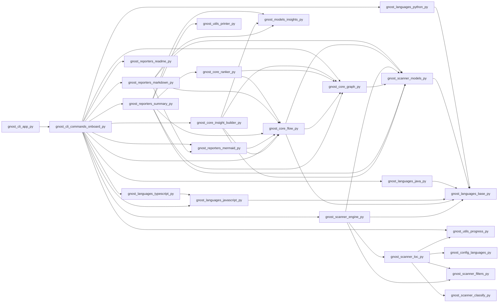
**Execution chain:** gnost/cli/app.py → gnost/cli/commands/onboard.py → gnost/core/flow.py → gnost/scanner/models.py → gnost/languages/base.py

#### Path Group 2

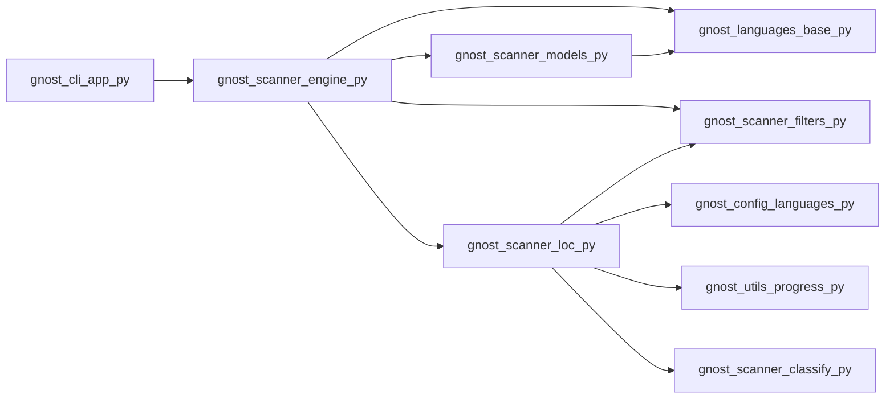
**Execution chain:** gnost/cli/app.py → gnost/cli/commands/onboard.py → gnost/core/flow.py → gnost/scanner/models.py → gnost/languages/base.py

### Combined Flow (All `cli` Paths)

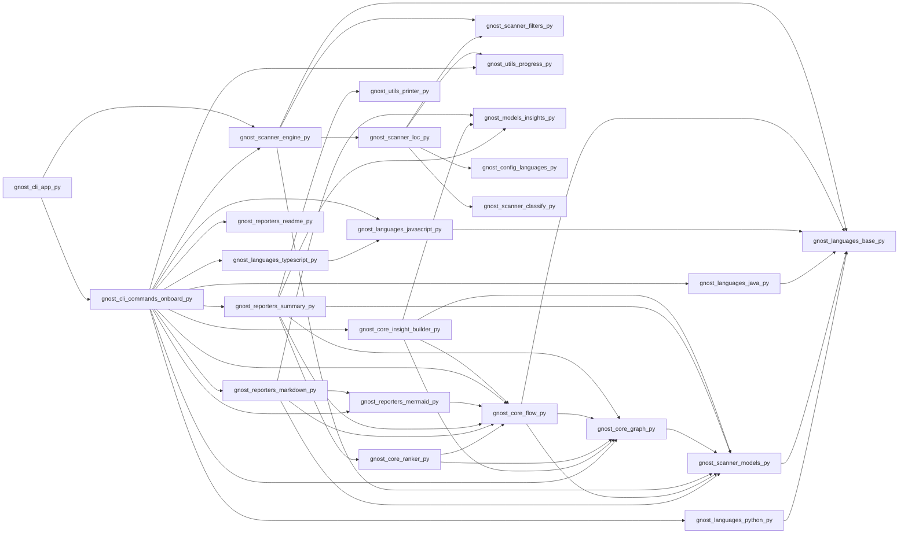

## Feature: `commands`

### Representative Paths

#### Path Group 1


**Execution chain:** gnost/cli/app.py → gnost/cli/commands/onboard.py → gnost/core/flow.py → gnost/scanner/models.py → gnost/languages/base.py

### Combined Flow (All `commands` Paths)


## Feature: `flow`

### Representative Paths

#### Path Group 1

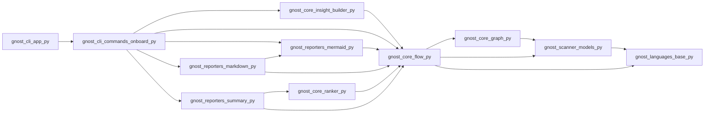
**Execution chain:** gnost/cli/app.py → gnost/cli/commands/onboard.py → gnost/core/flow.py → gnost/scanner/models.py → gnost/languages/base.py

### Combined Flow (All `flow` Paths)


## Feature: `gnost`

### Representative Paths

#### Path Group 1


**Execution chain:** gnost/cli/app.py → gnost/cli/commands/onboard.py → gnost/core/flow.py → gnost/scanner/models.py → gnost/languages/base.py

#### Path Group 2


**Execution chain:** gnost/cli/app.py → gnost/cli/commands/onboard.py → gnost/core/flow.py → gnost/scanner/models.py → gnost/languages/base.py

### Combined Flow (All `gnost` Paths)


## Feature: `java`

### Representative Paths

#### Path Group 1

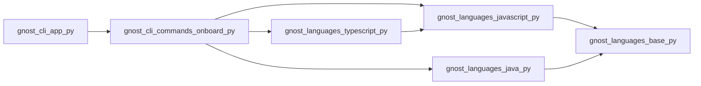
**Execution chain:** gnost/cli/app.py → gnost/cli/commands/onboard.py → gnost/core/flow.py → gnost/scanner/models.py → gnost/languages/base.py

### Combined Flow (All `java` Paths)


## Feature: `languages`

### Representative Paths

#### Path Group 1

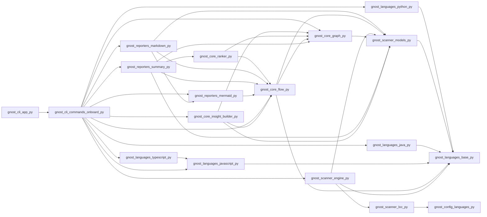
**Execution chain:** gnost/cli/app.py → gnost/cli/commands/onboard.py → gnost/core/flow.py → gnost/scanner/models.py → gnost/languages/base.py

#### Path Group 2

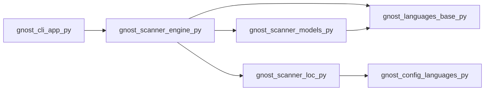
**Execution chain:** gnost/cli/app.py → gnost/cli/commands/onboard.py → gnost/core/flow.py → gnost/scanner/models.py → gnost/languages/base.py

### Combined Flow (All `languages` Paths)

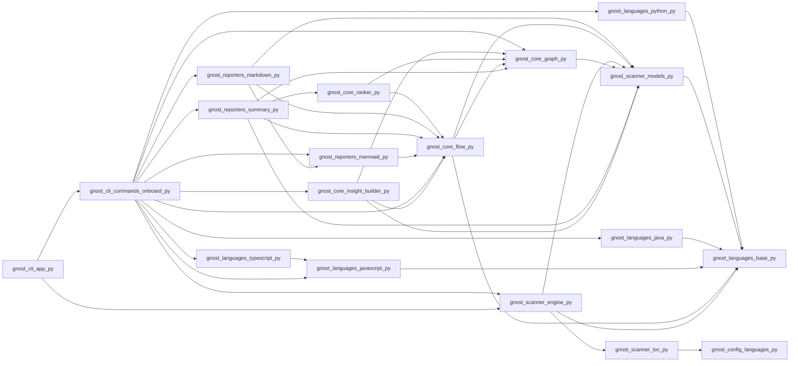

## Feature: `models`

### Representative Paths

#### Path Group 1

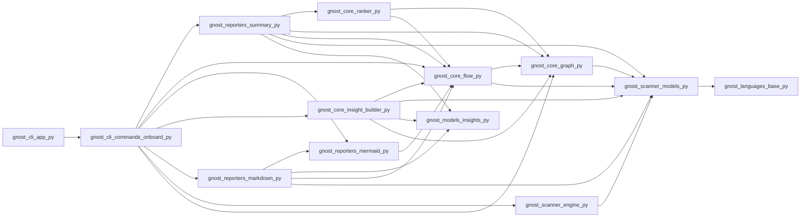
**Execution chain:** gnost/cli/app.py → gnost/cli/commands/onboard.py → gnost/core/flow.py → gnost/scanner/models.py → gnost/languages/base.py

#### Path Group 2

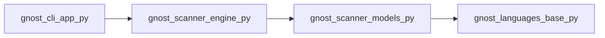
**Execution chain:** gnost/cli/app.py → gnost/cli/commands/onboard.py → gnost/core/flow.py → gnost/scanner/models.py → gnost/languages/base.py

### Combined Flow (All `models` Paths)

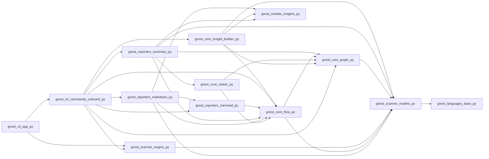

## Feature: `reporters`

### Representative Paths

#### Path Group 1

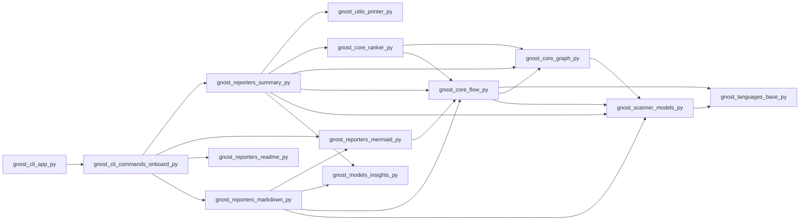
**Execution chain:** gnost/cli/app.py → gnost/cli/commands/onboard.py → gnost/core/flow.py → gnost/scanner/models.py → gnost/languages/base.py

### Combined Flow (All `reporters` Paths)


## Feature: `scanner`

### Representative Paths

#### Path Group 1

```mermaid
flowchart LR
  gnost_core_insight_builder_py --> gnost_core_flow_py
  gnost_scanner_engine_py --> gnost_languages_base_py
  gnost_cli_commands_onboard_py --> gnost_reporters_summary_py
  gnost_scanner_engine_py --> gnost_scanner_loc_py
  gnost_cli_commands_onboard_py --> gnost_core_flow_py
  gnost_reporters_mermaid_py --> gnost_core_flow_py
  gnost_core_insight_builder_py --> gnost_scanner_models_py
  gnost_reporters_markdown_py --> gnost_reporters_mermaid_py
  gnost_reporters_summary_py --> gnost_core_ranker_py
  gnost_reporters_summary_py --> gnost_core_graph_py
  gnost_reporters_summary_py --> gnost_core_flow_py
  gnost_scanner_engine_py --> gnost_scanner_filters_py
  gnost_reporters_summary_py --> gnost_scanner_models_py
  gnost_scanner_loc_py --> gnost_utils_progress_py
  gnost_cli_commands_onboard_py --> gnost_reporters_mermaid_py
  gnost_cli_app_py --> gnost_cli_commands_onboard_py
  gnost_core_graph_py --> gnost_scanner_models_py
  gnost_cli_commands_onboard_py --> gnost_core_insight_builder_py
  gnost_scanner_engine_py --> gnost_scanner_models_py
  gnost_core_flow_py --> gnost_core_graph_py
  gnost_scanner_loc_py --> gnost_scanner_filters_py
  gnost_scanner_models_py --> gnost_languages_base_py
  gnost_cli_commands_onboard_py --> gnost_reporters_markdown_py
  gnost_cli_commands_onboard_py --> gnost_scanner_engine_py
  gnost_core_ranker_py --> gnost_core_graph_py
  gnost_reporters_markdown_py --> gnost_core_flow_py
  gnost_scanner_loc_py --> gnost_config_languages_py
  gnost_core_flow_py --> gnost_scanner_models_py
  gnost_core_insight_builder_py --> gnost_core_graph_py
  gnost_scanner_loc_py --> gnost_scanner_classify_py
  gnost_reporters_markdown_py --> gnost_scanner_models_py
  gnost_core_ranker_py --> gnost_core_flow_py
  gnost_cli_commands_onboard_py --> gnost_core_graph_py
```
**Execution chain:** gnost/cli/app.py → gnost/cli/commands/onboard.py → gnost/core/flow.py → gnost/scanner/models.py → gnost/languages/base.py

#### Path Group 2

```mermaid
flowchart LR
  gnost_scanner_engine_py --> gnost_languages_base_py
  gnost_scanner_engine_py --> gnost_scanner_filters_py
  gnost_scanner_models_py --> gnost_languages_base_py
  gnost_scanner_engine_py --> gnost_scanner_loc_py
  gnost_scanner_engine_py --> gnost_scanner_models_py
  gnost_scanner_loc_py --> gnost_config_languages_py
  gnost_scanner_loc_py --> gnost_utils_progress_py
  gnost_cli_app_py --> gnost_scanner_engine_py
  gnost_scanner_loc_py --> gnost_scanner_classify_py
  gnost_scanner_loc_py --> gnost_scanner_filters_py
```
**Execution chain:** gnost/cli/app.py → gnost/cli/commands/onboard.py → gnost/core/flow.py → gnost/scanner/models.py → gnost/languages/base.py

### Combined Flow (All `scanner` Paths)

```mermaid
flowchart LR
  gnost_core_insight_builder_py --> gnost_core_flow_py
  gnost_scanner_engine_py --> gnost_languages_base_py
  gnost_cli_commands_onboard_py --> gnost_reporters_summary_py
  gnost_scanner_engine_py --> gnost_scanner_loc_py
  gnost_cli_commands_onboard_py --> gnost_core_flow_py
  gnost_reporters_mermaid_py --> gnost_core_flow_py
  gnost_core_insight_builder_py --> gnost_scanner_models_py
  gnost_reporters_markdown_py --> gnost_reporters_mermaid_py
  gnost_cli_app_py --> gnost_scanner_engine_py
  gnost_reporters_summary_py --> gnost_core_ranker_py
  gnost_reporters_summary_py --> gnost_core_graph_py
  gnost_reporters_summary_py --> gnost_core_flow_py
  gnost_scanner_engine_py --> gnost_scanner_filters_py
  gnost_reporters_summary_py --> gnost_scanner_models_py
  gnost_scanner_loc_py --> gnost_utils_progress_py
  gnost_cli_commands_onboard_py --> gnost_reporters_mermaid_py
  gnost_cli_app_py --> gnost_cli_commands_onboard_py
  gnost_core_graph_py --> gnost_scanner_models_py
  gnost_cli_commands_onboard_py --> gnost_core_insight_builder_py
  gnost_scanner_engine_py --> gnost_scanner_models_py
  gnost_core_flow_py --> gnost_core_graph_py
  gnost_scanner_loc_py --> gnost_scanner_filters_py
  gnost_scanner_models_py --> gnost_languages_base_py
  gnost_cli_commands_onboard_py --> gnost_reporters_markdown_py
  gnost_cli_commands_onboard_py --> gnost_scanner_engine_py
  gnost_core_ranker_py --> gnost_core_graph_py
  gnost_reporters_markdown_py --> gnost_core_flow_py
  gnost_scanner_loc_py --> gnost_config_languages_py
  gnost_core_flow_py --> gnost_scanner_models_py
  gnost_core_insight_builder_py --> gnost_core_graph_py
  gnost_scanner_loc_py --> gnost_scanner_classify_py
  gnost_reporters_markdown_py --> gnost_scanner_models_py
  gnost_core_ranker_py --> gnost_core_flow_py
  gnost_cli_commands_onboard_py --> gnost_core_graph_py
```

## Feature: `user`

### Representative Paths

#### Path Group 1

```mermaid
flowchart LR
  gnost_core_insight_builder_py --> gnost_core_flow_py
  gnost_scanner_engine_py --> gnost_languages_base_py
  gnost_cli_commands_onboard_py --> gnost_reporters_summary_py
  gnost_cli_commands_onboard_py --> gnost_languages_java_py
  gnost_scanner_engine_py --> gnost_scanner_loc_py
  gnost_cli_commands_onboard_py --> gnost_core_flow_py
  gnost_reporters_mermaid_py --> gnost_core_flow_py
  gnost_core_insight_builder_py --> gnost_scanner_models_py
  gnost_reporters_markdown_py --> gnost_reporters_mermaid_py
  gnost_reporters_summary_py --> gnost_utils_printer_py
  gnost_reporters_summary_py --> gnost_core_ranker_py
  gnost_reporters_summary_py --> gnost_core_graph_py
  gnost_reporters_summary_py --> gnost_core_flow_py
  gnost_scanner_engine_py --> gnost_scanner_filters_py
  gnost_cli_commands_onboard_py --> gnost_languages_javascript_py
  gnost_reporters_summary_py --> gnost_scanner_models_py
  gnost_core_flow_py --> gnost_languages_base_py
  gnost_cli_commands_onboard_py --> gnost_reporters_mermaid_py
  gnost_scanner_loc_py --> gnost_utils_progress_py
  gnost_languages_javascript_py --> gnost_languages_base_py
  gnost_cli_app_py --> gnost_cli_commands_onboard_py
  gnost_core_graph_py --> gnost_scanner_models_py
  gnost_languages_java_py --> gnost_languages_base_py
  gnost_cli_commands_onboard_py --> gnost_utils_progress_py
  gnost_cli_commands_onboard_py --> gnost_core_insight_builder_py
  gnost_reporters_markdown_py --> gnost_models_insights_py
  gnost_scanner_engine_py --> gnost_scanner_models_py
  gnost_cli_commands_onboard_py --> gnost_reporters_readme_py
  gnost_core_insight_builder_py --> gnost_models_insights_py
  gnost_core_flow_py --> gnost_core_graph_py
  gnost_cli_commands_onboard_py --> gnost_languages_python_py
  gnost_scanner_loc_py --> gnost_scanner_filters_py
  gnost_scanner_models_py --> gnost_languages_base_py
  gnost_cli_commands_onboard_py --> gnost_languages_typescript_py
  gnost_cli_commands_onboard_py --> gnost_reporters_markdown_py
  gnost_cli_commands_onboard_py --> gnost_scanner_engine_py
  gnost_core_ranker_py --> gnost_core_graph_py
  gnost_reporters_markdown_py --> gnost_core_flow_py
  gnost_scanner_loc_py --> gnost_config_languages_py
  gnost_languages_python_py --> gnost_languages_base_py
  gnost_reporters_summary_py --> gnost_models_insights_py
  gnost_core_flow_py --> gnost_scanner_models_py
  gnost_core_insight_builder_py --> gnost_core_graph_py
  gnost_scanner_loc_py --> gnost_scanner_classify_py
  gnost_reporters_markdown_py --> gnost_scanner_models_py
  gnost_languages_typescript_py --> gnost_languages_javascript_py
  gnost_core_ranker_py --> gnost_core_flow_py
  gnost_cli_commands_onboard_py --> gnost_core_graph_py
```
**Execution chain:** gnost/cli/app.py → gnost/cli/commands/onboard.py → gnost/core/flow.py → gnost/scanner/models.py → gnost/languages/base.py

#### Path Group 2

```mermaid
flowchart LR
  gnost_scanner_engine_py --> gnost_languages_base_py
  gnost_scanner_engine_py --> gnost_scanner_filters_py
  gnost_scanner_models_py --> gnost_languages_base_py
  gnost_scanner_engine_py --> gnost_scanner_loc_py
  gnost_scanner_engine_py --> gnost_scanner_models_py
  gnost_scanner_loc_py --> gnost_config_languages_py
  gnost_scanner_loc_py --> gnost_utils_progress_py
  gnost_cli_app_py --> gnost_scanner_engine_py
  gnost_scanner_loc_py --> gnost_scanner_classify_py
  gnost_scanner_loc_py --> gnost_scanner_filters_py
```
**Execution chain:** gnost/cli/app.py → gnost/cli/commands/onboard.py → gnost/core/flow.py → gnost/scanner/models.py → gnost/languages/base.py

### Combined Flow (All `user` Paths)

```mermaid
flowchart LR
  gnost_core_insight_builder_py --> gnost_core_flow_py
  gnost_scanner_engine_py --> gnost_languages_base_py
  gnost_cli_commands_onboard_py --> gnost_reporters_summary_py
  gnost_cli_commands_onboard_py --> gnost_languages_java_py
  gnost_scanner_engine_py --> gnost_scanner_loc_py
  gnost_cli_commands_onboard_py --> gnost_core_flow_py
  gnost_reporters_mermaid_py --> gnost_core_flow_py
  gnost_core_insight_builder_py --> gnost_scanner_models_py
  gnost_reporters_markdown_py --> gnost_reporters_mermaid_py
  gnost_cli_app_py --> gnost_scanner_engine_py
  gnost_reporters_summary_py --> gnost_utils_printer_py
  gnost_reporters_summary_py --> gnost_core_ranker_py
  gnost_reporters_summary_py --> gnost_core_graph_py
  gnost_reporters_summary_py --> gnost_core_flow_py
  gnost_scanner_engine_py --> gnost_scanner_filters_py
  gnost_cli_commands_onboard_py --> gnost_languages_javascript_py
  gnost_reporters_summary_py --> gnost_scanner_models_py
  gnost_core_flow_py --> gnost_languages_base_py
  gnost_cli_commands_onboard_py --> gnost_reporters_mermaid_py
  gnost_scanner_loc_py --> gnost_utils_progress_py
  gnost_languages_javascript_py --> gnost_languages_base_py
  gnost_cli_app_py --> gnost_cli_commands_onboard_py
  gnost_core_graph_py --> gnost_scanner_models_py
  gnost_languages_java_py --> gnost_languages_base_py
  gnost_cli_commands_onboard_py --> gnost_utils_progress_py
  gnost_cli_commands_onboard_py --> gnost_core_insight_builder_py
  gnost_reporters_markdown_py --> gnost_models_insights_py
  gnost_scanner_engine_py --> gnost_scanner_models_py
  gnost_cli_commands_onboard_py --> gnost_reporters_readme_py
  gnost_core_insight_builder_py --> gnost_models_insights_py
  gnost_core_flow_py --> gnost_core_graph_py
  gnost_cli_commands_onboard_py --> gnost_languages_python_py
  gnost_scanner_loc_py --> gnost_scanner_filters_py
  gnost_scanner_models_py --> gnost_languages_base_py
  gnost_cli_commands_onboard_py --> gnost_languages_typescript_py
  gnost_cli_commands_onboard_py --> gnost_reporters_markdown_py
  gnost_cli_commands_onboard_py --> gnost_scanner_engine_py
  gnost_core_ranker_py --> gnost_core_graph_py
  gnost_reporters_markdown_py --> gnost_core_flow_py
  gnost_scanner_loc_py --> gnost_config_languages_py
  gnost_languages_python_py --> gnost_languages_base_py
  gnost_reporters_summary_py --> gnost_models_insights_py
  gnost_core_flow_py --> gnost_scanner_models_py
  gnost_core_insight_builder_py --> gnost_core_graph_py
  gnost_scanner_loc_py --> gnost_scanner_classify_py
  gnost_reporters_markdown_py --> gnost_scanner_models_py
  gnost_languages_typescript_py --> gnost_languages_javascript_py
  gnost_core_ranker_py --> gnost_core_flow_py
  gnost_cli_commands_onboard_py --> gnost_core_graph_py
```
